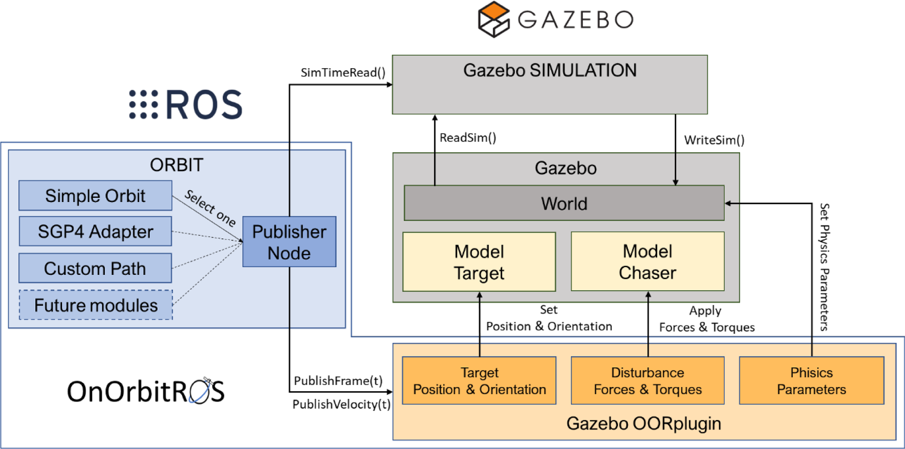

# Architecture of OnOrbitROS

OnOrbitROS serves as a foundational platform for the study and development of on-orbit applications, leveraging the powerful
combination of ROS and Gazebo for hyper-realistic simulations.

For extended information about this framework, its architecture and some applications go to [doi](https://doi.org/10.1016/j.simpat.2023.102790).

    José L. Ramón, Jorge Pomares, Leonard Felicetti,
    Task space control for on-orbit space robotics using a new ROS-based framework,
    Simulation Modelling Practice and Theory,
    Volume 127,
    2023,
    102790,
    ISSN 1569-190X,
    https://doi.org/10.1016/j.simpat.2023.102790
    (https://www.sciencedirect.com/science/article/pii/S1569190X23000679)

Here you can find the architecture of the framework. In the OnOrbitROS workspace installed (see [Installation Guide](/Install) for more info) you will find many pacakges, which are shown in this image. 

    python
def hello_world():
    print("Hello, world!")

hello_world()

