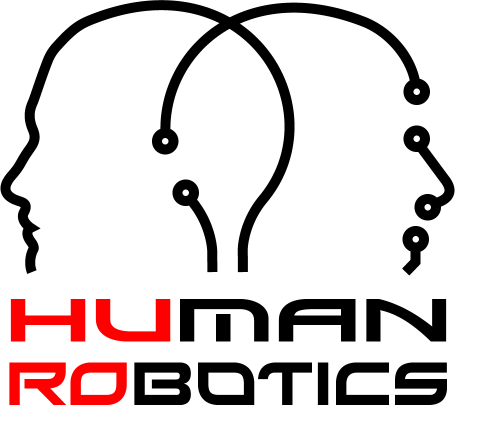

# Welcome to OnOrbitROS

OnOrbitROS is a unified open-source framework for space-robotics
simulations. It is based on Robot Operating System (ROS) and includes and reproduces the principal environmental conditions that eventual space robots and manipulators could experience in an on-orbit servicing scenario.

## About Us

    

Developed by Human Robotics (HURO) group, University of Alicante, Spain. 

Space robotics broadly encompasses the application of robots and autonomous systems for operations in the space environment. HURO Space Robotics section investigates the development of robotic systems and their control for performing tasks in space.

You can find more information about this project and other works in our website:
[HURO Space Robotics](https://www.huro.ua.es/index.php/research/research-lines/space-robotics)

